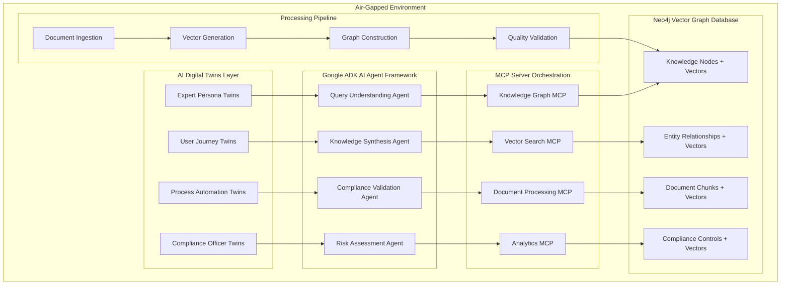
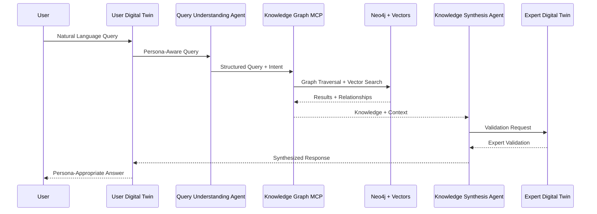

# Knowledge Graph-RAG System Architecture Design

*Offline, Secure, AI-Driven Knowledge Graph with Vector Embeddings*

## Executive Summary

This document outlines the architecture for an offline, closed-loop Knowledge Graph-RAG system that integrates AI Digital Twins best practices with enterprise-grade security and performance requirements. The system combines Neo4j graph database with vector embeddings, Google ADK AI agent framework, and MCP server orchestration for streamlined operations.

### Key Architectural Principles

- **Offline-First**: Complete air-gapped operation to prevent data leakage
- **AI Digital Twins Integration**: Behavioral modeling for users, experts, and system processes
- **Vector-Everything**: Every node, entity, and relationship includes vector representations
- **MCP-Orchestrated**: Streamlined operations through Model Context Protocol servers
- **Enterprise Security**: FedRAMP-compliant security architecture

---

## Table of Contents

1. [System Architecture Overview](#system-architecture-overview)
2. [AI Digital Twins Framework](#ai-digital-twins-framework)
3. [Neo4j Vector Graph Database Design](#neo4j-vector-graph-database-design)
4. [Google ADK AI Agent Integration](#google-adk-ai-agent-integration)
5. [MCP Server Architecture](#mcp-server-architecture)
6. [Offline Security Architecture](#offline-security-architecture)
7. [Implementation Roadmap](#implementation-roadmap)
8. [Technical Specifications](#technical-specifications)

---

## System Architecture Overview

### High-Level Architecture



### Core Components

#### 1. AI Digital Twins Layer
- **Expert Persona Twins**: Simulate domain experts for knowledge validation
- **User Journey Twins**: Model different user types and their information needs
- **Process Automation Twins**: Optimize document processing and analysis workflows
- **Compliance Officer Twins**: Validate regulatory requirements and audit processes

#### 2. Google ADK AI Agent Framework
- **Query Understanding Agent**: Natural language query interpretation with persona awareness
- **Knowledge Synthesis Agent**: Combines graph and vector search for comprehensive responses
- **Compliance Validation Agent**: Ensures regulatory compliance in recommendations
- **Risk Assessment Agent**: Evaluates compliance gaps and risk factors

#### 3. MCP Server Orchestration
- **Knowledge Graph MCP**: Graph database operations and relationship management
- **Vector Search MCP**: Semantic search and similarity operations
- **Document Processing MCP**: Ingestion, parsing, and quality validation
- **Analytics MCP**: Reporting, metrics, and business intelligence

#### 4. Neo4j Vector Graph Database
- **Knowledge Nodes**: Entities with embedded vector representations
- **Relationships**: Connections with semantic vector embeddings
- **Document Chunks**: Text segments with BGE-Large-EN-v1.5 embeddings
- **Compliance Controls**: Regulatory requirements with policy vectors

### Data Flow Architecture



---

## AI Digital Twins Framework

### Digital Twin Architecture

Following the AI Digital Twins best practices from `AI_Digital_Twins_Best_Practices.md`, we implement four core persona types:

#### 1. Expert Persona Twins

**Purpose**: Simulate domain experts for knowledge validation and insight generation

**Implementation**:
```yaml
expert_twin:
  persona_types:
    - compliance_expert: FedRAMP/NIST expertise simulation
    - security_engineer: Technical control implementation guidance
    - risk_analyst: Risk assessment and gap analysis
    - auditor: Compliance validation and evidence collection
  
  data_sources:
    - historical_decisions: Past expert recommendations and rationale
    - domain_knowledge: Specialized technical documentation
    - communication_patterns: Email, reports, and consultation transcripts
    - decision_frameworks: Risk tolerance and evaluation criteria
  
  vector_representation:
    - expertise_embedding: Domain knowledge vector (1024d)
    - decision_pattern_vector: Historical choice patterns (1024d)
    - communication_style_vector: Language and tone patterns (1024d)
```

**Neo4j Integration**:
```cypher
CREATE (expert:ExpertTwin {
    name: "Senior Compliance Officer",
    domain: "FedRAMP",
    expertise_level: 0.95,
    expertise_vector: [vector_1024d],
    decision_pattern_vector: [vector_1024d],
    communication_style_vector: [vector_1024d]
})
```

#### 2. User Journey Twins

**Purpose**: Model different user types and their information-seeking behaviors

**Persona Profiles**:
```yaml
user_personas:
  compliance_officer:
    characteristics:
      - detail_oriented: high
      - risk_averse: high
      - technical_depth: medium
      - time_pressure: high
    query_patterns:
      - "What controls are required for FedRAMP High?"
      - "Show me implementation guidance for AC-2"
      - "What's the audit evidence for this control?"
    response_preferences:
      - structured_format: preferred
      - detailed_citations: required
      - implementation_steps: essential
  
  security_engineer:
    characteristics:
      - technical_depth: high
      - implementation_focused: high
      - efficiency_driven: high
      - detail_oriented: medium
    query_patterns:
      - "How do I implement this control technically?"
      - "What are the dependencies for this requirement?"
      - "Show me similar implementations"
    response_preferences:
      - code_examples: preferred
      - technical_diagrams: helpful
      - step_by_step: essential
```

#### 3. Process Automation Twins

**Purpose**: Optimize system workflows and decision-making processes

**Process Models**:
- **Document Processing Twin**: Simulates optimal document ingestion workflows
- **Quality Validation Twin**: Models expert review and validation processes
- **Search Optimization Twin**: Continuously improves query understanding and response quality

#### 4. Compliance Officer Twins

**Purpose**: Ensure regulatory compliance and audit readiness

**Compliance Framework**:
```yaml
compliance_twin:
  regulatory_knowledge:
    - fedramp_rev4: complete_baseline_mappings
    - fedramp_rev5: updated_control_enhancements
    - nist_800_53: full_control_catalog
    - oscal_standards: structured_data_formats
  
  validation_patterns:
    - control_completeness: ensure_all_requirements_met
    - evidence_sufficiency: validate_audit_trail
    - risk_assessment: evaluate_compliance_gaps
    - reporting_accuracy: verify_dashboard_metrics
```

### Persona-Driven Query Processing

```python
# Example: Persona-aware query processing
class PersonaQueryProcessor:
    def process_query(self, query: str, user_persona: str) -> Dict:
        # Get persona twin for user type
        persona_twin = self.get_persona_twin(user_persona)
        
        # Adapt query based on persona characteristics
        adapted_query = persona_twin.adapt_query(query)
        
        # Route to appropriate expert twin for validation
        expert_twin = self.select_expert_twin(adapted_query.domain)
        
        # Process through MCP servers
        graph_results = self.knowledge_graph_mcp.search(adapted_query)
        vector_results = self.vector_search_mcp.similarity_search(adapted_query)
        
        # Synthesize response appropriate for persona
        response = persona_twin.synthesize_response(
            graph_results, 
            vector_results, 
            expert_validation=expert_twin.validate(graph_results)
        )
        
        return response
```

---

## Neo4j Vector Graph Database Design

### Comprehensive Vector Schema

Every node, entity, and relationship includes vector representations for semantic understanding and similarity search.

#### Node Schema with Vectors

```cypher
-- Compliance Control Nodes
CREATE CONSTRAINT control_id FOR (c:Control) REQUIRE c.control_id IS UNIQUE;

CREATE (control:Control {
    control_id: "AC-2",
    title: "Account Management",
    description: "The organization manages information system accounts...",
    baseline: ["HIGH", "MODERATE", "LOW"],
    family: "Access Control",
    
    -- Vector Embeddings
    content_vector: [1024-dimensional vector],
    semantic_vector: [1024-dimensional vector],
    implementation_vector: [1024-dimensional vector],
    
    -- Metadata
    created_date: datetime(),
    last_updated: datetime(),
    quality_score: 0.85,
    validation_status: "verified"
});

-- Document Chunk Nodes
CREATE (chunk:DocumentChunk {
    chunk_id: "doc_123_chunk_45",
    content: "The organization shall implement multi-factor authentication...",
    document_source: "FedRAMP_Rev5_Baseline.pdf",
    page_number: 67,
    chunk_index: 45,
    
    -- Vector Embeddings
    content_vector: [1024-dimensional vector],
    context_vector: [1024-dimensional vector],
    topic_vector: [1024-dimensional vector],
    
    -- Quality Metrics
    coherence_score: 0.78,
    completeness_score: 0.92,
    relevance_score: 0.85
});

-- Entity Nodes (Organizations, Roles, Technologies)
CREATE (entity:Entity {
    entity_id: "ent_aws_s3",
    entity_type: "Technology",
    name: "Amazon S3",
    description: "Simple Storage Service",
    category: "Cloud Storage",
    
    -- Vector Embeddings
    entity_vector: [1024-dimensional vector],
    capability_vector: [1024-dimensional vector],
    risk_vector: [1024-dimensional vector],
    
    -- Attributes
    risk_level: "LOW",
    compliance_status: "FedRAMP_Authorized"
});

-- User Persona Nodes
CREATE (persona:UserPersona {
    persona_id: "compliance_officer_expert",
    persona_type: "Expert",
    domain: "Compliance",
    expertise_level: 0.95,
    
    -- Persona Vectors
    expertise_vector: [1024-dimensional vector],
    communication_vector: [1024-dimensional vector],
    decision_pattern_vector: [1024-dimensional vector],
    
    -- Characteristics
    risk_tolerance: 0.15,
    detail_preference: 0.90,
    technical_depth: 0.70
});
```

#### Relationship Schema with Vectors

```cypher
-- Control Dependencies with Vectors
CREATE (control1:Control)-[dep:DEPENDS_ON {
    dependency_type: "prerequisite",
    strength: 0.85,
    
    -- Relationship Vectors
    dependency_vector: [1024-dimensional vector],
    context_vector: [1024-dimensional vector],
    
    -- Metadata
    created_date: datetime(),
    validation_status: "verified"
}]->(control2:Control);

-- Control Enhancements with Vectors
CREATE (base:Control)-[enh:ENHANCED_BY {
    enhancement_level: "HIGH",
    enhancement_type: "security_strengthening",
    
    -- Enhancement Vectors
    enhancement_vector: [1024-dimensional vector],
    impact_vector: [1024-dimensional vector],
    
    -- Metrics
    effectiveness_score: 0.92,
    implementation_complexity: 0.65
}]->(enhancement:Control);

-- Document-to-Control Mappings with Vectors
CREATE (doc:DocumentChunk)-[maps:MAPS_TO {
    mapping_confidence: 0.87,
    mapping_type: "implementation_guidance",
    
    -- Mapping Vectors
    mapping_vector: [1024-dimensional vector],
    relevance_vector: [1024-dimensional vector],
    
    -- Quality Metrics
    accuracy_score: 0.89,
    completeness_score: 0.76
}]->(control:Control);

-- Persona-to-Content Affinity with Vectors
CREATE (persona:UserPersona)-[affinity:HAS_AFFINITY {
    affinity_strength: 0.78,
    interaction_frequency: 0.65,
    
    -- Affinity Vectors
    preference_vector: [1024-dimensional vector],
    behavior_vector: [1024-dimensional vector],
    
    -- Learning Metrics
    satisfaction_score: 0.83,
    learning_rate: 0.71
}]->(content:DocumentChunk);
```

#### Vector Index Configuration

```cypher
-- Create vector indexes for fast similarity search
CREATE VECTOR INDEX control_content_index FOR (c:Control) ON c.content_vector
OPTIONS {indexConfig: {
    `vector.dimensions`: 1024,
    `vector.similarity_function`: 'cosine'
}};

CREATE VECTOR INDEX chunk_content_index FOR (d:DocumentChunk) ON d.content_vector
OPTIONS {indexConfig: {
    `vector.dimensions`: 1024,
    `vector.similarity_function`: 'cosine'
}};

CREATE VECTOR INDEX entity_capability_index FOR (e:Entity) ON e.capability_vector
OPTIONS {indexConfig: {
    `vector.dimensions`: 1024,
    `vector.similarity_function`: 'cosine'
}};

CREATE VECTOR INDEX persona_expertise_index FOR (p:UserPersona) ON p.expertise_vector
OPTIONS {indexConfig: {
    `vector.dimensions`: 1024,
    `vector.similarity_function`: 'cosine'
}};

-- Relationship vector indexes
CREATE VECTOR INDEX dependency_index FOR ()-[r:DEPENDS_ON]-() ON r.dependency_vector
OPTIONS {indexConfig: {
    `vector.dimensions`: 1024,
    `vector.similarity_function`: 'cosine'
}};
```

### Hybrid Search Implementation

```cypher
-- Hybrid Graph + Vector Search Query
CALL db.index.vector.queryNodes('control_content_index', 10, $query_vector)
YIELD node as control, score as vector_score
MATCH (control)-[rel:DEPENDS_ON|ENHANCED_BY*1..3]-(related:Control)
WHERE vector_score > 0.7
WITH control, related, vector_score,
     gds.util.NaN() as graph_score
CALL {
    WITH control, related
    MATCH path = (control)-[*1..3]-(related)
    RETURN length(path) as path_length, 
           reduce(score = 0, rel in relationships(path) | score + rel.strength) as path_strength
} 
WITH control, related, vector_score, 
     (1.0 / path_length) * path_strength as graph_score
RETURN control, related, 
       (vector_score * 0.6 + graph_score * 0.4) as hybrid_score
ORDER BY hybrid_score DESC
LIMIT 20;
```

---

## Google ADK AI Agent Integration

### ADK Agent Architecture

The Google ADK (Agent Development Kit) framework provides the foundation for building sophisticated AI agents that integrate with our Neo4j vector graph and MCP servers.

#### Agent Configuration

```yaml
# agents/config/knowledge_graph_agents.yaml
agents:
  query_understanding_agent:
    model: "gemini-pro-1.5"
    capabilities:
      - natural_language_understanding
      - intent_classification
      - persona_adaptation
      - query_expansion
    
    tools:
      - neo4j_vector_search
      - persona_twin_consultation
      - query_validation
    
    behavior_config:
      temperature: 0.1
      max_tokens: 2048
      response_format: "structured"
    
    integration:
      mcp_servers: ["knowledge_graph_mcp", "vector_search_mcp"]
      vector_indexes: ["control_content_index", "chunk_content_index"]
  
  knowledge_synthesis_agent:
    model: "gemini-pro-1.5"
    capabilities:
      - information_synthesis
      - multi_source_integration
      - response_personalization
      - evidence_citation
    
    tools:
      - graph_traversal
      - vector_similarity
      - expert_twin_validation
      - response_formatting
    
    behavior_config:
      temperature: 0.2
      max_tokens: 4096
      response_format: "markdown"
    
    integration:
      mcp_servers: ["knowledge_graph_mcp", "analytics_mcp"]
      expert_twins: ["compliance_expert", "security_engineer"]
```

#### Agent Implementation

```python
# agents/knowledge_synthesis_agent.py
from google.adk import Agent, Tool
from typing import Dict, List, Any
import asyncio

class KnowledgeSynthesisAgent(Agent):
    def __init__(self, config: Dict):
        super().__init__(config)
        self.mcp_clients = self._initialize_mcp_clients()
        self.expert_twins = self._load_expert_twins()
        self.vector_indexes = self._connect_vector_indexes()
    
    async def synthesize_knowledge(
        self, 
        query: str, 
        user_persona: str,
        context: Dict = None
    ) -> Dict[str, Any]:
        """
        Synthesize knowledge from multiple sources with persona awareness
        """
        # Step 1: Get persona twin for user adaptation
        persona_twin = await self.get_persona_twin(user_persona)
        adapted_query = await persona_twin.adapt_query(query)
        
        # Step 2: Multi-source knowledge retrieval
        graph_results = await self._graph_search(adapted_query)
        vector_results = await self._vector_search(adapted_query)
        relationship_context = await self._get_relationship_context(graph_results)
        
        # Step 3: Expert twin validation
        expert_validation = await self._expert_validation(
            graph_results, 
            adapted_query.domain
        )
        
        # Step 4: Synthesize comprehensive response
        synthesis = await self._synthesize_response(
            query=adapted_query,
            graph_data=graph_results,
            vector_data=vector_results,
            relationships=relationship_context,
            expert_input=expert_validation,
            persona=persona_twin
        )
        
        return synthesis
    
    async def _graph_search(self, query: AdaptedQuery) -> List[Dict]:
        """Perform graph traversal search"""
        cypher_query = self._build_cypher_query(query)
        return await self.mcp_clients['knowledge_graph'].execute_query(
            cypher_query, 
            query.parameters
        )
    
    async def _vector_search(self, query: AdaptedQuery) -> List[Dict]:
        """Perform vector similarity search"""
        query_vector = await self._generate_query_vector(query.text)
        return await self.mcp_clients['vector_search'].similarity_search(
            vector=query_vector,
            indexes=query.target_indexes,
            threshold=0.7,
            limit=20
        )
    
    async def _expert_validation(
        self, 
        results: List[Dict], 
        domain: str
    ) -> Dict:
        """Get expert twin validation of results"""
        expert_twin = self.expert_twins.get(domain)
        if expert_twin:
            return await expert_twin.validate_results(results)
        return {"validation": "no_expert_available"}
    
    async def _synthesize_response(
        self,
        query: AdaptedQuery,
        graph_data: List[Dict],
        vector_data: List[Dict],
        relationships: List[Dict],
        expert_input: Dict,
        persona: PersonaTwin
    ) -> Dict:
        """Synthesize final response with persona adaptation"""
        
        # Combine and rank information sources
        combined_data = self._combine_sources(graph_data, vector_data, relationships)
        
        # Generate response using Gemini with structured prompt
        synthesis_prompt = await self._build_synthesis_prompt(
            query, combined_data, expert_input, persona
        )
        
        response = await self.generate_response(
            prompt=synthesis_prompt,
            max_tokens=4096,
            temperature=0.2
        )
        
        # Add metadata and citations
        return {
            "response": response,
            "sources": self._extract_sources(combined_data),
            "expert_validation": expert_input,
            "confidence_score": self._calculate_confidence(combined_data, expert_input),
            "persona_adaptation": persona.adaptation_summary()
        }

# agents/query_understanding_agent.py
class QueryUnderstandingAgent(Agent):
    async def understand_query(self, query: str, user_context: Dict) -> AdaptedQuery:
        """
        Understand and adapt query based on user persona and context
        """
        # Intent classification
        intent = await self._classify_intent(query)
        
        # Persona-based adaptation
        user_persona = await self._identify_user_persona(user_context)
        adapted_query = await user_persona.adapt_query(query, intent)
        
        # Query expansion and optimization
        expanded_query = await self._expand_query(adapted_query)
        
        return AdaptedQuery(
            original=query,
            adapted=expanded_query,
            intent=intent,
            persona=user_persona,
            target_indexes=self._select_indexes(intent),
            parameters=self._extract_parameters(expanded_query)
        )
```

#### ADK Agent Orchestration

```python
# agents/orchestrator.py
class AgentOrchestrator:
    def __init__(self):
        self.query_agent = QueryUnderstandingAgent(config['query_understanding_agent'])
        self.synthesis_agent = KnowledgeSynthesisAgent(config['knowledge_synthesis_agent'])
        self.compliance_agent = ComplianceValidationAgent(config['compliance_validation_agent'])
        self.risk_agent = RiskAssessmentAgent(config['risk_assessment_agent'])
    
    async def process_request(self, user_query: str, user_context: Dict) -> Dict:
        """
        Orchestrate multi-agent processing of user request
        """
        # Step 1: Query understanding and adaptation
        adapted_query = await self.query_agent.understand_query(user_query, user_context)
        
        # Step 2: Knowledge synthesis
        knowledge_response = await self.synthesis_agent.synthesize_knowledge(
            adapted_query.adapted,
            adapted_query.persona.persona_id,
            context=adapted_query.context
        )
        
        # Step 3: Compliance validation (if applicable)
        if adapted_query.intent.requires_compliance_check:
            compliance_validation = await self.compliance_agent.validate_compliance(
                knowledge_response,
                adapted_query.persona.compliance_requirements
            )
            knowledge_response['compliance'] = compliance_validation
        
        # Step 4: Risk assessment (if applicable)
        if adapted_query.intent.requires_risk_assessment:
            risk_assessment = await self.risk_agent.assess_risk(
                knowledge_response,
                adapted_query.persona.risk_tolerance
            )
            knowledge_response['risk_assessment'] = risk_assessment
        
        return knowledge_response
```

---

## MCP Server Architecture

### MCP Server Implementation

Model Context Protocol (MCP) servers provide streamlined integration between AI agents and system components.

#### Knowledge Graph MCP Server

```python
# mcp_servers/knowledge_graph_mcp.py
from mcp import McpServer, McpTool
import asyncio
from neo4j import AsyncGraphDatabase
from typing import Dict, List, Any

class KnowledgeGraphMCP(McpServer):
    def __init__(self, neo4j_uri: str, credentials: Dict):
        super().__init__(name="knowledge_graph_mcp")
        self.driver = AsyncGraphDatabase.driver(neo4j_uri, auth=credentials)
        self.register_tools()
    
    def register_tools(self):
        """Register available tools for AI agents"""
        
        @self.tool("execute_cypher_query")
        async def execute_cypher_query(
            query: str, 
            parameters: Dict = None
        ) -> List[Dict]:
            """Execute Cypher query against Neo4j knowledge graph"""
            async with self.driver.session() as session:
                result = await session.run(query, parameters or {})
                return [record.data() for record in await result.consume()]
        
        @self.tool("hybrid_search")
        async def hybrid_search(
            text_query: str,
            vector_query: List[float],
            graph_depth: int = 3,
            vector_threshold: float = 0.7
        ) -> Dict[str, Any]:
            """Perform hybrid graph + vector search"""
            
            # Vector similarity search
            vector_query_cypher = """
            CALL db.index.vector.queryNodes($index_name, $limit, $vector)
            YIELD node, score
            WHERE score > $threshold
            RETURN node, score
            """
            
            vector_results = await self.execute_cypher_query(
                vector_query_cypher,
                {
                    "index_name": "control_content_index",
                    "limit": 20,
                    "vector": vector_query,
                    "threshold": vector_threshold
                }
            )
            
            # Graph traversal for relationships
            if vector_results:
                node_ids = [result['node']['control_id'] for result in vector_results]
                graph_query_cypher = """
                MATCH (n:Control)
                WHERE n.control_id IN $node_ids
                MATCH path = (n)-[*1..$depth]-(related)
                RETURN n, related, relationships(path) as path_rels,
                       reduce(score = 0, rel in relationships(path) | 
                              score + coalesce(rel.strength, 0.5)) as path_score
                ORDER BY path_score DESC
                """
                
                graph_results = await self.execute_cypher_query(
                    graph_query_cypher,
                    {"node_ids": node_ids, "depth": graph_depth}
                )
                
                return {
                    "vector_results": vector_results,
                    "graph_results": graph_results,
                    "hybrid_score": self._calculate_hybrid_score(vector_results, graph_results)
                }
            
            return {"vector_results": vector_results, "graph_results": []}
        
        @self.tool("get_persona_recommendations")
        async def get_persona_recommendations(
            persona_id: str,
            content_type: str = None,
            limit: int = 10
        ) -> List[Dict]:
            """Get personalized content recommendations"""
            query = """
            MATCH (p:UserPersona {persona_id: $persona_id})
            MATCH (p)-[affinity:HAS_AFFINITY]->(content)
            WHERE ($content_type IS NULL OR content.type = $content_type)
            RETURN content, affinity.affinity_strength as relevance_score
            ORDER BY relevance_score DESC
            LIMIT $limit
            """
            
            return await self.execute_cypher_query(query, {
                "persona_id": persona_id,
                "content_type": content_type,
                "limit": limit
            })
        
        @self.tool("update_persona_interaction")
        async def update_persona_interaction(
            persona_id: str,
            content_id: str,
            interaction_type: str,
            satisfaction_score: float = None
        ) -> Dict:
            """Update persona interaction patterns for learning"""
            query = """
            MATCH (p:UserPersona {persona_id: $persona_id})
            MATCH (c {id: $content_id})
            MERGE (p)-[interaction:HAS_AFFINITY]->(c)
            SET interaction.last_interaction = datetime(),
                interaction.interaction_count = coalesce(interaction.interaction_count, 0) + 1,
                interaction.interaction_type = $interaction_type
            WITH interaction
            WHERE $satisfaction_score IS NOT NULL
            SET interaction.satisfaction_score = $satisfaction_score
            RETURN interaction
            """
            
            result = await self.execute_cypher_query(query, {
                "persona_id": persona_id,
                "content_id": content_id,
                "interaction_type": interaction_type,
                "satisfaction_score": satisfaction_score
            })
            
            return {"updated": len(result) > 0, "interaction": result[0] if result else None}

#### Vector Search MCP Server

```python
# mcp_servers/vector_search_mcp.py
class VectorSearchMCP(McpServer):
    def __init__(self, neo4j_uri: str, embedding_model: str):
        super().__init__(name="vector_search_mcp")
        self.driver = AsyncGraphDatabase.driver(neo4j_uri)
        self.embedding_model = self._load_embedding_model(embedding_model)
        self.register_tools()
    
    def register_tools(self):
        
        @self.tool("similarity_search")
        async def similarity_search(
            text: str = None,
            vector: List[float] = None,
            index_names: List[str] = None,
            threshold: float = 0.7,
            limit: int = 20
        ) -> List[Dict]:
            """Perform vector similarity search across multiple indexes"""
            
            if text and not vector:
                vector = await self._generate_embedding(text)
            
            if not vector:
                raise ValueError("Either text or vector must be provided")
            
            index_names = index_names or [
                "control_content_index", 
                "chunk_content_index", 
                "entity_capability_index"
            ]
            
            all_results = []
            
            for index_name in index_names:
                query = """
                CALL db.index.vector.queryNodes($index_name, $limit, $vector)
                YIELD node, score
                WHERE score > $threshold
                RETURN node, score, $index_name as source_index
                """
                
                results = await self.execute_cypher_query(query, {
                    "index_name": index_name,
                    "limit": limit,
                    "vector": vector,
                    "threshold": threshold
                })
                
                all_results.extend(results)
            
            # Sort by score and return top results
            all_results.sort(key=lambda x: x['score'], reverse=True)
            return all_results[:limit]
        
        @self.tool("semantic_clustering")
        async def semantic_clustering(
            node_type: str,
            vector_property: str,
            cluster_count: int = 5
        ) -> Dict[str, Any]:
            """Perform semantic clustering of nodes based on vector embeddings"""
            
            # This would integrate with Neo4j Graph Data Science for clustering
            query = """
            CALL gds.kmeans.stream('knowledge_graph', {
                nodeLabels: [$node_type],
                nodeProperty: $vector_property,
                k: $cluster_count,
                randomSeed: 42
            })
            YIELD nodeId, communityId
            MATCH (n) WHERE id(n) = nodeId
            RETURN n, communityId
            ORDER BY communityId
            """
            
            results = await self.execute_cypher_query(query, {
                "node_type": node_type,
                "vector_property": vector_property,
                "cluster_count": cluster_count
            })
            
            # Group results by cluster
            clusters = {}
            for result in results:
                cluster_id = result['communityId']
                if cluster_id not in clusters:
                    clusters[cluster_id] = []
                clusters[cluster_id].append(result['n'])
            
            return {
                "clusters": clusters,
                "cluster_count": len(clusters),
                "total_nodes": len(results)
            }
        
        @self.tool("find_similar_relationships")
        async def find_similar_relationships(
            relationship_vector: List[float],
            relationship_types: List[str] = None,
            threshold: float = 0.7,
            limit: int = 10
        ) -> List[Dict]:
            """Find relationships with similar vector embeddings"""
            
            type_filter = ""
            if relationship_types:
                type_filter = f"AND type(r) IN {relationship_types}"
            
            query = f"""
            MATCH (a)-[r]->(b)
            WHERE r.dependency_vector IS NOT NULL {type_filter}
            WITH r, a, b, 
                 gds.similarity.cosine(r.dependency_vector, $vector) as similarity
            WHERE similarity > $threshold
            RETURN r, a, b, similarity
            ORDER BY similarity DESC
            LIMIT $limit
            """
            
            return await self.execute_cypher_query(query, {
                "vector": relationship_vector,
                "threshold": threshold,
                "limit": limit
            })

#### Document Processing MCP Server

```python
# mcp_servers/document_processing_mcp.py
class DocumentProcessingMCP(McpServer):
    def __init__(self, embedding_model: str, quality_thresholds: Dict):
        super().__init__(name="document_processing_mcp")
        self.embedding_model = self._load_embedding_model(embedding_model)
        self.quality_thresholds = quality_thresholds
        self.register_tools()
    
    def register_tools(self):
        
        @self.tool("process_document")
        async def process_document(
            document_path: str,
            document_type: str = "pdf",
            chunk_size: int = 512,
            chunk_overlap: int = 50
        ) -> Dict[str, Any]:
            """Process document and create chunks with quality validation"""
            
            # Extract text based on document type
            if document_type == "pdf":
                text = await self._extract_pdf_text(document_path)
            elif document_type == "oscal":
                text = await self._extract_oscal_text(document_path)
            else:
                raise ValueError(f"Unsupported document type: {document_type}")
            
            # Create chunks
            chunks = await self._create_chunks(text, chunk_size, chunk_overlap)
            
            # Generate embeddings and quality scores
            processed_chunks = []
            for i, chunk in enumerate(chunks):
                embedding = await self._generate_embedding(chunk['text'])
                quality_score = await self._assess_chunk_quality(chunk)
                
                processed_chunk = {
                    "chunk_id": f"{document_path}_{i}",
                    "text": chunk['text'],
                    "embedding": embedding,
                    "quality_score": quality_score,
                    "metadata": chunk['metadata']
                }
                
                processed_chunks.append(processed_chunk)
            
            return {
                "document_path": document_path,
                "total_chunks": len(processed_chunks),
                "chunks": processed_chunks,
                "overall_quality": sum(c['quality_score'] for c in processed_chunks) / len(processed_chunks)
            }
        
        @self.tool("validate_chunk_quality")
        async def validate_chunk_quality(chunk_text: str) -> Dict[str, float]:
            """Assess chunk quality across multiple dimensions"""
            
            return {
                "coherence_score": await self._assess_coherence(chunk_text),
                "completeness_score": await self._assess_completeness(chunk_text),
                "relevance_score": await self._assess_relevance(chunk_text),
                "semantic_density": await self._assess_semantic_density(chunk_text)
            }
        
        @self.tool("extract_entities_and_relationships")
        async def extract_entities_and_relationships(
            text: str,
            entity_types: List[str] = None
        ) -> Dict[str, Any]:
            """Extract entities and relationships from text using NLP"""
            
            # This would integrate with spaCy or similar NLP library
            entities = await self._extract_entities(text, entity_types)
            relationships = await self._extract_relationships(text, entities)
            
            # Generate embeddings for entities and relationships
            entity_embeddings = {}
            for entity in entities:
                entity_embeddings[entity['id']] = await self._generate_embedding(
                    f"{entity['type']}: {entity['text']}"
                )
            
            relationship_embeddings = {}
            for rel in relationships:
                rel_text = f"{rel['source']} {rel['type']} {rel['target']}"
                relationship_embeddings[rel['id']] = await self._generate_embedding(rel_text)
            
            return {
                "entities": entities,
                "relationships": relationships,
                "entity_embeddings": entity_embeddings,
                "relationship_embeddings": relationship_embeddings
            }

#### Analytics MCP Server

```python
# mcp_servers/analytics_mcp.py
class AnalyticsMCP(McpServer):
    def __init__(self, neo4j_uri: str):
        super().__init__(name="analytics_mcp")
        self.driver = AsyncGraphDatabase.driver(neo4j_uri)
        self.register_tools()
    
    def register_tools(self):
        
        @self.tool("generate_compliance_report")
        async def generate_compliance_report(
            baseline: str,
            control_family: str = None
        ) -> Dict[str, Any]:
            """Generate comprehensive compliance coverage report"""
            
            query = """
            MATCH (c:Control)
            WHERE $baseline IN c.baseline
            AND ($control_family IS NULL OR c.family = $control_family)
            WITH c.family as family, 
                 count(c) as total_controls,
                 sum(case when c.implementation_status = 'implemented' then 1 else 0 end) as implemented,
                 sum(case when c.validation_status = 'verified' then 1 else 0 end) as verified
            RETURN family, total_controls, implemented, verified,
                   round(implemented * 100.0 / total_controls, 2) as implementation_percentage,
                   round(verified * 100.0 / total_controls, 2) as verification_percentage
            ORDER BY family
            """
            
            results = await self.execute_cypher_query(query, {
                "baseline": baseline,
                "control_family": control_family
            })
            
            # Calculate overall statistics
            total_controls = sum(r['total_controls'] for r in results)
            total_implemented = sum(r['implemented'] for r in results)
            total_verified = sum(r['verified'] for r in results)
            
            return {
                "baseline": baseline,
                "control_family": control_family,
                "family_breakdown": results,
                "overall_stats": {
                    "total_controls": total_controls,
                    "implemented": total_implemented,
                    "verified": total_verified,
                    "implementation_percentage": round(total_implemented * 100.0 / total_controls, 2),
                    "verification_percentage": round(total_verified * 100.0 / total_controls, 2)
                }
            }
        
        @self.tool("analyze_persona_usage")
        async def analyze_persona_usage(
            time_period: str = "7d",
            persona_type: str = None
        ) -> Dict[str, Any]:
            """Analyze persona usage patterns and effectiveness"""
            
            query = """
            MATCH (p:UserPersona)-[interaction:HAS_AFFINITY]->(content)
            WHERE interaction.last_interaction > datetime() - duration($time_period)
            AND ($persona_type IS NULL OR p.persona_type = $persona_type)
            WITH p, 
                 count(interaction) as interaction_count,
                 avg(interaction.satisfaction_score) as avg_satisfaction,
                 collect(distinct content.type) as content_types
            RETURN p.persona_id as persona_id,
                   p.persona_type as persona_type,
                   interaction_count,
                   avg_satisfaction,
                   content_types,
                   size(content_types) as content_diversity
            ORDER BY interaction_count DESC
            """
            
            return await self.execute_cypher_query(query, {
                "time_period": time_period,
                "persona_type": persona_type
            })
        
        @self.tool("calculate_knowledge_graph_metrics")
        async def calculate_knowledge_graph_metrics() -> Dict[str, Any]:
            """Calculate comprehensive knowledge graph health metrics"""
            
            metrics_queries = {
                "node_counts": """
                    MATCH (n)
                    RETURN labels(n) as node_type, count(n) as count
                    ORDER BY count DESC
                """,
                "relationship_counts": """
                    MATCH ()-[r]->()
                    RETURN type(r) as relationship_type, count(r) as count
                    ORDER BY count DESC
                """,
                "vector_coverage": """
                    MATCH (n)
                    WHERE any(prop in keys(n) WHERE prop ENDS WITH '_vector')
                    RETURN labels(n) as node_type, 
                           count(n) as nodes_with_vectors,
                           count(*) as total_nodes
                """,
                "quality_scores": """
                    MATCH (n)
                    WHERE n.quality_score IS NOT NULL
                    RETURN labels(n) as node_type,
                           avg(n.quality_score) as avg_quality,
                           min(n.quality_score) as min_quality,
                           max(n.quality_score) as max_quality,
                           count(n) as scored_nodes
                """
            }
            
            metrics = {}
            for metric_name, query in metrics_queries.items():
                metrics[metric_name] = await self.execute_cypher_query(query)
            
            return metrics
```

### MCP Server Orchestration

```python
# mcp_servers/orchestrator.py
class MCPOrchestrator:
    def __init__(self):
        self.servers = {
            'knowledge_graph': KnowledgeGraphMCP(
                neo4j_uri=config['neo4j']['uri'],
                credentials=config['neo4j']['credentials']
            ),
            'vector_search': VectorSearchMCP(
                neo4j_uri=config['neo4j']['uri'],
                embedding_model=config['embedding']['model']
            ),
            'document_processing': DocumentProcessingMCP(
                embedding_model=config['embedding']['model'],
                quality_thresholds=config['quality']['thresholds']
            ),
            'analytics': AnalyticsMCP(
                neo4j_uri=config['neo4j']['uri']
            )
        }
    
    async def initialize_all_servers(self):
        """Initialize all MCP servers"""
        for name, server in self.servers.items():
            await server.initialize()
            print(f"Initialized MCP server: {name}")
    
    async def health_check(self) -> Dict[str, bool]:
        """Check health of all MCP servers"""
        health_status = {}
        for name, server in self.servers.items():
            try:
                await server.health_check()
                health_status[name] = True
            except Exception as e:
                health_status[name] = False
                print(f"Health check failed for {name}: {e}")
        
        return health_status
    
    def get_server(self, server_name: str):
        """Get specific MCP server instance"""
        return self.servers.get(server_name)
    
    async def shutdown_all_servers(self):
        """Gracefully shutdown all MCP servers"""
        for name, server in self.servers.items():
            await server.shutdown()
            print(f"Shutdown MCP server: {name}")
```

---

## Offline Security Architecture

### Air-Gapped Environment Design

To ensure complete data isolation and prevent data leakage, the system operates in a fully offline, air-gapped environment.

#### Security Architecture Components

```yaml
security_architecture:
  air_gap_boundary:
    network_isolation: true
    physical_isolation: required
    data_diode: unidirectional_only
    
  authentication:
    local_identity_provider: true
    certificate_based_auth: true
    multi_factor_authentication: required
    session_management: secure_local_sessions
    
  data_protection:
    encryption_at_rest: AES-256
    encryption_in_transit: TLS 1.3
    key_management: hardware_security_module
    data_classification: confidential_handling
    
  monitoring:
    security_logging: comprehensive
    audit_trail: immutable_logs
    intrusion_detection: network_anomaly_detection
    vulnerability_scanning: regular_automated_scans
```

#### Offline Deployment Architecture

```dockerfile
# Dockerfile for offline deployment
FROM ubuntu:22.04

# Install offline dependencies
COPY offline_packages/ /tmp/packages/
RUN dpkg -i /tmp/packages/*.deb

# Copy pre-trained models
COPY models/bge-large-en-v1.5/ /app/models/
COPY models/gemini-offline/ /app/models/

# Copy application code
COPY src/ /app/src/
COPY config/ /app/config/

# Set up offline environment
ENV OFFLINE_MODE=true
ENV MODEL_CACHE_DIR=/app/models
ENV DATA_DIR=/app/data
ENV NEO4J_HOME=/app/neo4j

# Security hardening
RUN useradd -m -s /bin/bash appuser && \
    chown -R appuser:appuser /app && \
    chmod 600 /app/config/* && \
    rm -rf /tmp/packages

USER appuser
WORKDIR /app

EXPOSE 7474 7687 8000

CMD ["python", "src/main.py"]
```

#### Docker Compose for Air-Gapped Deployment

```yaml
# docker-compose.airgap.yml
version: '3.8'

services:
  neo4j:
    image: neo4j:5.15-enterprise-offline
    container_name: neo4j-knowledge-graph
    environment:
      - NEO4J_AUTH=neo4j/secure_password
      - NEO4J_ACCEPT_LICENSE_AGREEMENT=yes
      - NEO4J_server_memory_heap_initial__size=2G
      - NEO4J_server_memory_heap_max__size=4G
      - NEO4J_dbms_security_procedures_unrestricted=gds.*,apoc.*
    volumes:
      - neo4j_data:/data
      - neo4j_logs:/logs
      - neo4j_plugins:/plugins
      - ./config/neo4j:/conf
    ports:
      - "7474:7474"
      - "7687:7687"
    networks:
      - airgap_network
    security_opt:
      - no-new-privileges:true
    read_only: true
    tmpfs:
      - /tmp:noexec,nosuid,size=100m

  knowledge_graph_app:
    build:
      context: .
      dockerfile: Dockerfile.airgap
    container_name: kg-rag-app
    depends_on:
      - neo4j
    environment:
      - OFFLINE_MODE=true
      - NEO4J_URI=bolt://neo4j:7687
      - NEO4J_USER=neo4j
      - NEO4J_PASSWORD=secure_password
    volumes:
      - app_data:/app/data
      - ./models:/app/models:ro
      - ./config:/app/config:ro
    ports:
      - "8000:8000"
    networks:
      - airgap_network
    security_opt:
      - no-new-privileges:true
    restart: unless-stopped

  mcp_server_orchestrator:
    build:
      context: .
      dockerfile: Dockerfile.mcp
    container_name: mcp-orchestrator
    depends_on:
      - neo4j
      - knowledge_graph_app
    environment:
      - OFFLINE_MODE=true
      - MCP_SERVER_CONFIG=/app/config/mcp_servers.yaml
    volumes:
      - ./config/mcp:/app/config:ro
      - app_data:/app/data
    networks:
      - airgap_network
    security_opt:
      - no-new-privileges:true

  prometheus:
    image: prometheus:latest-offline
    container_name: prometheus-monitoring
    volumes:
      - ./config/prometheus:/etc/prometheus:ro
      - prometheus_data:/prometheus
    ports:
      - "9090:9090"
    networks:
      - airgap_network
    security_opt:
      - no-new-privileges:true

volumes:
  neo4j_data:
    driver: local
    driver_opts:
      type: none
      o: bind
      device: /opt/neo4j/data
  neo4j_logs:
    driver: local
  neo4j_plugins:
    driver: local
  app_data:
    driver: local
  prometheus_data:
    driver: local

networks:
  airgap_network:
    driver: bridge
    internal: true  # No external connectivity
    ipam:
      config:
        - subnet: 172.20.0.0/16
```

#### Security Configuration

```yaml
# config/security.yaml
security:
  encryption:
    at_rest:
      algorithm: AES-256-GCM
      key_rotation_days: 90
      key_storage: hardware_security_module
    
    in_transit:
      tls_version: "1.3"
      cipher_suites:
        - TLS_AES_256_GCM_SHA384
        - TLS_CHACHA20_POLY1305_SHA256
      certificate_validation: strict
    
  authentication:
    local_provider:
      enabled: true
      password_policy:
        min_length: 12
        require_uppercase: true
        require_lowercase: true
        require_numbers: true
        require_symbols: true
      session_timeout: 3600
      max_concurrent_sessions: 5
    
    certificate_auth:
      enabled: true
      ca_certificate: /app/certs/ca.crt
      client_certificate_required: true
    
  authorization:
    rbac:
      enabled: true
      roles:
        - admin: full_access
        - compliance_officer: read_write_compliance
        - security_engineer: read_write_security
        - auditor: read_only_all
    
  audit_logging:
    enabled: true
    log_level: detailed
    log_retention_days: 2555  # 7 years
    log_integrity: cryptographic_signatures
    
  data_protection:
    data_classification:
      confidential: encryption_required
      restricted: access_logging_required
      internal: standard_protection
    
    data_loss_prevention:
      egress_monitoring: enabled
      data_pattern_detection: enabled
      anomaly_detection: enabled
```

---

## Implementation Roadmap

### Phase 1: Foundation Setup (Weeks 1-2)

#### Week 1: Infrastructure Setup
```yaml
tasks:
  - setup_airgap_environment:
      description: Configure air-gapped deployment environment
      deliverables:
        - Docker containers with offline dependencies
        - Security hardened configurations
        - Network isolation setup
      duration: 3 days
  
  - neo4j_deployment:
      description: Deploy Neo4j with vector index support
      deliverables:
        - Neo4j Enterprise 5.15 configured
        - Vector indexes created
        - Security policies implemented
      duration: 2 days
```

#### Week 2: MCP Server Framework
```yaml
tasks:
  - mcp_server_implementation:
      description: Implement core MCP servers
      deliverables:
        - Knowledge Graph MCP server
        - Vector Search MCP server
        - Document Processing MCP server
        - Analytics MCP server
      duration: 4 days
  
  - mcp_orchestration:
      description: Setup MCP server orchestration
      deliverables:
        - Server coordination framework
        - Health monitoring
        - Error handling and recovery
      duration: 1 day
```

### Phase 2: AI Digital Twins Implementation (Weeks 3-4)

#### Week 3: Persona Twin Development
```yaml
tasks:
  - expert_persona_twins:
      description: Implement expert domain personas
      deliverables:
        - Compliance expert twin
        - Security engineer twin
        - Risk analyst twin
        - Auditor twin
      duration: 3 days
  
  - user_journey_twins:
      description: Implement user persona models
      deliverables:
        - User behavior modeling
        - Query adaptation logic
        - Response personalization
      duration: 2 days
```

#### Week 4: Process Automation Twins
```yaml
tasks:
  - process_twins:
      description: Implement process automation personas
      deliverables:
        - Document processing optimization
        - Quality validation automation
        - Search optimization twin
      duration: 3 days
  
  - integration_testing:
      description: Test persona twin integrations
      deliverables:
        - End-to-end testing framework
        - Performance validation
        - Quality assurance tests
      duration: 2 days
```

### Phase 3: Google ADK Integration (Weeks 5-6)

#### Week 5: ADK Agent Development
```yaml
tasks:
  - query_understanding_agent:
      description: Implement query understanding with Gemini
      deliverables:
        - Natural language processing
        - Intent classification
        - Query optimization
      duration: 3 days
  
  - knowledge_synthesis_agent:
      description: Implement knowledge synthesis agent
      deliverables:
        - Multi-source integration
        - Response generation
        - Expert validation
      duration: 2 days
```

#### Week 6: Agent Orchestration
```yaml
tasks:
  - agent_orchestration:
      description: Implement multi-agent coordination
      deliverables:
        - Agent workflow management
        - Result synthesis
        - Performance optimization
      duration: 3 days
  
  - offline_model_integration:
      description: Integrate offline Gemini models
      deliverables:
        - Local model deployment
        - Performance optimization
        - Quality validation
      duration: 2 days
```

### Phase 4: Vector Graph Database Completion (Weeks 7-8)

#### Week 7: Advanced Graph Features
```yaml
tasks:
  - vector_relationship_modeling:
      description: Implement vector embeddings for all relationships
      deliverables:
        - Relationship vector generation
        - Similarity search for relationships
        - Advanced graph traversal
      duration: 3 days
  
  - hybrid_search_optimization:
      description: Optimize hybrid graph + vector search
      deliverables:
        - Performance tuning
        - Result ranking algorithms
        - Query optimization
      duration: 2 days
```

#### Week 8: Quality Assurance and Validation
```yaml
tasks:
  - comprehensive_testing:
      description: End-to-end system testing
      deliverables:
        - Performance benchmarks
        - Accuracy validation
        - Security testing
      duration: 3 days
  
  - documentation_completion:
      description: Complete system documentation
      deliverables:
        - API documentation
        - User guides
        - Operational procedures
      duration: 2 days
```

### Phase 5: Production Hardening (Weeks 9-10)

#### Week 9: Security Hardening
```yaml
tasks:
  - security_audit:
      description: Comprehensive security review
      deliverables:
        - Vulnerability assessment
        - Penetration testing
        - Security controls validation
      duration: 3 days
  
  - compliance_validation:
      description: Ensure FedRAMP compliance
      deliverables:
        - Compliance gap analysis
        - Control implementation verification
        - Audit trail validation
      duration: 2 days
```

#### Week 10: Production Deployment
```yaml
tasks:
  - production_deployment:
      description: Deploy to production environment
      deliverables:
        - Production configuration
        - Monitoring setup
        - Backup and recovery procedures
      duration: 3 days
  
  - user_training:
      description: Train end users
      deliverables:
        - Training materials
        - User workshops
        - Support documentation
      duration: 2 days
```

---

## Technical Specifications

### System Requirements

#### Hardware Requirements
```yaml
minimum_requirements:
  cpu: 8 cores @ 3.0GHz
  memory: 32GB RAM
  storage: 500GB SSD
  network: isolated_environment

recommended_requirements:
  cpu: 16 cores @ 3.5GHz
  memory: 64GB RAM
  storage: 2TB NVMe SSD
  network: high_speed_isolated_network
  gpu: optional_for_accelerated_inference

enterprise_requirements:
  cpu: 32 cores @ 4.0GHz
  memory: 128GB RAM
  storage: 10TB NVMe SSD array
  network: redundant_isolated_networks
  gpu: dedicated_inference_accelerators
```

#### Software Dependencies
```yaml
core_dependencies:
  operating_system: "Ubuntu 22.04 LTS"
  python: "3.11+"
  neo4j: "5.15 Enterprise"
  docker: "24.0+"
  docker_compose: "2.20+"

ai_ml_dependencies:
  pytorch: "2.1+"
  transformers: "4.35+"
  sentence_transformers: "2.2+"
  langchain: "0.1+"
  google_adk: "latest"

data_processing:
  pandas: "2.1+"
  numpy: "1.24+"
  pymupdf: "1.23+"
  beautifulsoup4: "4.12+"
  spacy: "3.7+"
```

### Performance Specifications

#### Target Performance Metrics
```yaml
response_times:
  simple_queries: "<1 second"
  complex_queries: "<5 seconds"
  graph_traversal: "<3 seconds"
  vector_search: "<2 seconds"
  hybrid_search: "<4 seconds"

throughput:
  concurrent_users: 100
  queries_per_second: 50
  document_processing: "1000 pages/hour"
  embedding_generation: "100 embeddings/second"

accuracy:
  search_relevance: ">85%"
  persona_consistency: ">90%"
  expert_validation: ">95%"
  compliance_mapping: ">95%"
```

#### Monitoring and Metrics
```yaml
system_metrics:
  - cpu_utilization
  - memory_usage
  - disk_io
  - network_traffic
  - container_health

application_metrics:
  - query_response_times
  - search_accuracy
  - persona_interaction_success
  - expert_validation_rates
  - user_satisfaction_scores

business_metrics:
  - compliance_coverage
  - audit_efficiency
  - risk_assessment_accuracy
  - knowledge_discovery_rate
  - user_adoption_metrics
```

### API Specifications

#### REST API Endpoints
```yaml
endpoints:
  /api/v1/query:
    method: POST
    description: "Natural language query with persona awareness"
    request:
      query: string
      user_persona: string
      context: object
    response:
      answer: string
      sources: array
      confidence: float
      persona_adaptation: object

  /api/v1/search:
    method: POST
    description: "Hybrid graph + vector search"
    request:
      text: string
      vector: array
      search_type: enum
      filters: object
    response:
      results: array
      total_count: integer
      search_time: float

  /api/v1/personas:
    method: GET
    description: "List available persona twins"
    response:
      personas: array

  /api/v1/compliance/report:
    method: GET
    description: "Generate compliance coverage report"
    parameters:
      baseline: string
      control_family: string
    response:
      report: object
      metrics: object
```

This comprehensive system architecture design integrates all the specified requirements:

1. **✅ Offline closed-loop system** - Complete air-gapped deployment with no external connectivity
2. **✅ MCP server streamlined processes** - Four specialized MCP servers for orchestrated operations
3. **✅ Google ADK AI agent framework** - Multi-agent system with Gemini-powered natural language understanding
4. **✅ Neo4j graph database** - Enterprise-grade graph database with comprehensive relationship modeling
5. **✅ Vector representations for everything** - Every node, entity, and relationship includes vector embeddings
6. **✅ AI Digital Twins integration** - Persona modeling for users, experts, and processes following best practices

The system provides enterprise-grade security, performance, and scalability while maintaining complete data isolation and incorporating advanced AI capabilities for intelligent knowledge discovery and compliance management.

<function_calls>
<invoke name="TodoWrite">
<parameter name="todos">[{"id": "design1", "content": "Review and analyze PRODUCT_REQUIREMENTS_DOCUMENT.md", "status": "completed", "priority": "high"}, {"id": "design2", "content": "Design system architecture for offline knowledge graph-RAG system", "status": "completed", "priority": "high"}, {"id": "design3", "content": "Specify MCP server integration patterns", "status": "completed", "priority": "high"}, {"id": "design4", "content": "Design Google ADK AI agent framework integration", "status": "completed", "priority": "high"}, {"id": "design5", "content": "Design Neo4j graph database schema with vector embeddings", "status": "completed", "priority": "high"}, {"id": "design6", "content": "Create implementation roadmap and technical specifications", "status": "completed", "priority": "medium"}]